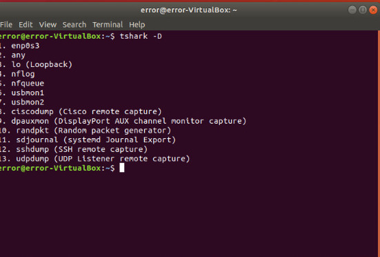
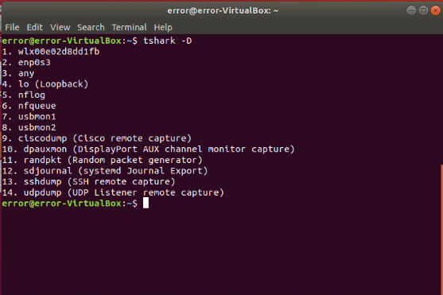
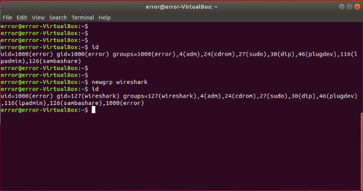
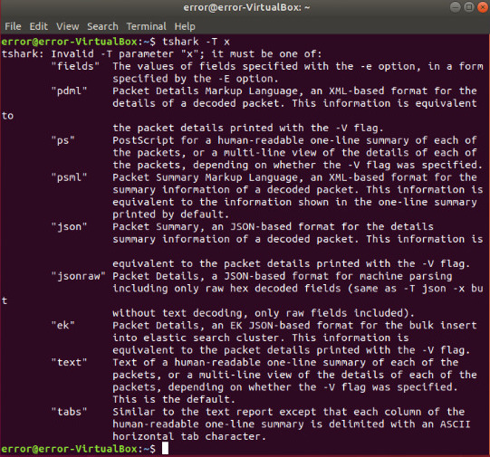
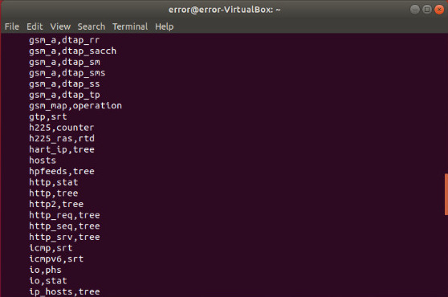
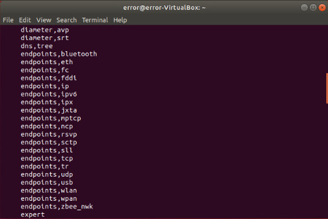

Many of you must have used **Wireshark** it's a packet analyzer used to analyse packets but it is efficient only for small scale analysis when it comes to analyse packets at large scale it becomes difficult to do with Wireshark because it needs lots of plugins as compared to **Tshark**  it is companion utility it uses the same parsing engine which is used by Wireshark  but it is very much powerful. Tshark is command line based tool but great for automation.

Wireshark and Tshark are cross-platform tool already installed in many linux distro but since this tools get updating we also need to update this tool time to time


#### INSTALLATION

First update your system and check the current version of Tshark and Wireshark in your system.

```bash
error@error:~$ sudo apt update
error@error:~$ sudo apt-cache madison wireshark


error@error:~$ sudo apt-cache madison tshark

```
You can see the official [website](https://www.wireshark.org/#download)  of Wireshark and see the latest version if it's same as in you machine than okay otherwise update it with  stable version with below command

```bash
error@error:~$ sudo add-apt-repository  ppa:wireshark-dev/stable

```
this will add the latest stable repo of wireshark now you just need to update it.

```bash
error@error:~$ sudo apt install wireshark tshark

```
---

Now everything is installed and updated  we need to do some configuration if your are running your Linux distro on Virtual Box but lets first see the basic coomand of **tshark** to see the interfaces :

```bash
error@error:~$ tshark -D

```



See the number of interfaces will vary and  order get shuffled from device to device because if connect your wireless card some more number of interfaces will be displayed like this.



**To select any interface you address it with its name or by it's number** if you start tshark by the command

```bash
error@error:~$ tshark

```

### SETUP (mailny for Virtual Box)

It will not capture any packets  and if you use this command

```bash
error@error:~$ sudo tshark
[sudo] password for error:

```

>After entering password it will show you prompt but still not capture any packets because capturing network traffic as 'root' because and parsing vulnerablity of wireshark or tshark can comprise your system so everytime using 'sudo' is annoying so we need change  setting to use wireshark and tshark comfortably.

```
error@error:~$ sudo dpkg -reconfigure wireshark-common

```
A prompt will appear asking that *non super user can capture packets* click *yes* save tht and move forward

```
error@error:~$ usermod -a -G wireshark $USER
error@error:~$ id

```
>By using id it will dispay all settings but all this configuration will be reflected only when you *restart* your machine or run the below commands after *id* to avoid restarting.



---

#### BASIC's

Now run tshark :

```
error@error:~$ tshark

```

and this time it will start capturing packets and by default it tshark selects the first interface. *Open a new tab for bash and ping any website*

```
error@error:~$ ping google.com

```
and in different tab run :

```bash
error@error:~$ tshark -i any

```

this will capture packets in *any* mode you can also write any specific mode by it name or number:  

```bash
error@error:~$ tshark -i  interface_name/ID number

```
#### MODES

Let's see about the *modes* in details:

- DEFAULT BEHAVIOUR:
 - only Unicast,Broadcast and choose Multicast packets

- Promiscuous Mode:
 - All recived packets
 - Network topology needs to make sense

- Monitor Mode:
 - Applies to 802.11 interface only

Above all modes *Promiscuous Mode* can recive all packets but it was way possible in *HUB connections* in morden types of connectoin like *Switch* it's not possible to capture all packets.
To switch to *Promiscuous Mode* run the below command:

```bash
error@error:~$ sudo ifconfig interface_name promisc

```

##### WRITING AND EXPORTING DATA
---

First ping any url

```
error@error:~$ ping google.com

```

To see some this packets run the below command:

```
error@error:~$ tshark -i wlan0

```

To save  packets

```
error@error:~$ tshark -i wlan0 -w test.pcap

```
Tp set a capture counts **-c**

```
error@error:~$ tshark -i wlan0 -c 20 -w test.pcap

```
> It will capture 20 packets

To view the files

```
error@error:~$ tshark -r test.pcap | less

```
To see the details of packets
```
error@error:~$ tshark -r test.pcap -c 1 -V

```
Options to **export** packets

```
error@error:~$ tshark -T x

```


>You can use any options by using the commands

```
error@error:~$ tshark -r test.pcap -T  option_name

```

example:
```
error@error:~$ tshark -r test.pcap -T  psml | less

```

To save the listed data in a:

```
error@error:~$ tshark -r test.pcap -T  psml > test.psml

```
---

#### CAPTURE AN DISPLAY Filters

In common scenario whenever we capture packets we generally are intrested in specific types of packets lik http,icmp,tcp... lets see how to capture filter in t-tshark but please read the [documentaion](https://www.wireshark.org/docs/man-pages/pcap-filter.html) for detailed info.

```
error@error:~$ tshark -i interface_name -f "filter_name" -w filter_name.pcap

```
example:

```
error@error:~$ tshark -i interface_name -f "tcp port 80" -w tcp.pcap

```
> It will capture all the packet on port 80, see the documentaion for more filter detail

**Display filters**

Display filters works on already captured packets.

```
error@error:~$ tshark -r file_name.pcap  -Y ' filter expression '

```


example:
```
error@error:~$ tshark -r tcp.pcap  -Y 'http.request.method == "GET" '

```

##### Converting Packets to HTML

Sometimes we need to share **captured packets** but reciver may not have a tool like wireshark to view so it's better to covert it into html file so it can viwed on browser.

>save packets

```
error@error:~$ tshark -i wlan0 -w test.pcap

```
output  the saved file in pdml
```
error@error:~$ tshark -r test.pcap -T  pdml | less

```

Save it xml formate

```
error@error:~$ tshark -r test.pcap -T  pdml > test.xml

```
if you list  /usr/share/wireshark/ you will find it contains one utility **pdml2html** which help us to convert pdml file to html but we also need one more utility

```
error@error:~$ sudo apt install xsltproc

```
After installing write the final command to convert to pcap file into html

```
error@error:~$ xsltproc /usr/share/wireshark/pdml2html.xsl test.xml > test.html

```

---

##### SUMMARIES (Protocols, Summary and Read Filters)

If you want to see protocol hierarchy of any captured packets you need to open **pcap** file in the Wireshark and go to **Statistics Tab** from there you can see this let' see how to do the same stuff using wireshark.

This commands list all help for statistics

```
error@error:~$ tshark -z help

```


and for **protocol hierarchy** we need **io-phs**

```
error@error:~$ tshark -r file_name.pcap -z io.phs

```
>Above command fill show the protocol hierarchy but it will go through all the regular traffic if you directly want to see it and avoid traffic use **-q**

```
error@error:~$ tshark -r file_name.pcap -g -z io.phs

```

**To Apply filters :**

```
error@error:~$ tshark -r file_name.pcap -q -z io.phs,filter_name

```
example:

```
error@error:~$ tshark -r file_name.pcap -g -z io.phs,ip

```
```
error@error:~$ tshark -r file_name.pcap -g -z io.phs,http

```

---

#### To see the endpoints any packet filters

```
error@error:~$ tshark -r file_name.pcap -q -z endpoints,name

```
example :
```
error@error:~$ tshark -r file_name.pcap -q -z endpoints,wlan

```

Converstations helps to tie relationship between endpoints.

```
error@error:~$ tshark -r file_name.pcap -q -z conv,name

```

In Wireshark we use **expert** information it shows problem and warnings :

```
error@error:~$ tshark -r file_name.pcap -q -z expert

```

##### Multi File Capture (RING BUUFER)

While capturing packets we can't predict the size of packets so if captures are vey large and it is possible that we will be  out of disk and it's difficult to keep monitoring In order to solve this problem we can use **Ring buffer**, once end of buffer is reached, start overwriting oldest data it's a very common data structure of networking

>Tshark command to use ring buffer

```
error@error:~$ tshark -i interface_name -w file_name.pcap -b filesize:(enter size you want ) -b  files:(enter number you want )

```

example:
```
error@error:~$ tshark -i wlan0  -w ring.pcap -b filesize:1 -b  files:10

```

> It creates 10 files of size 1KB once done  with 10 files it start overwriting first file and it will continue.

---
